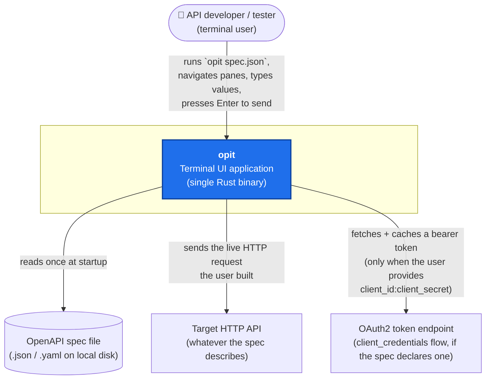
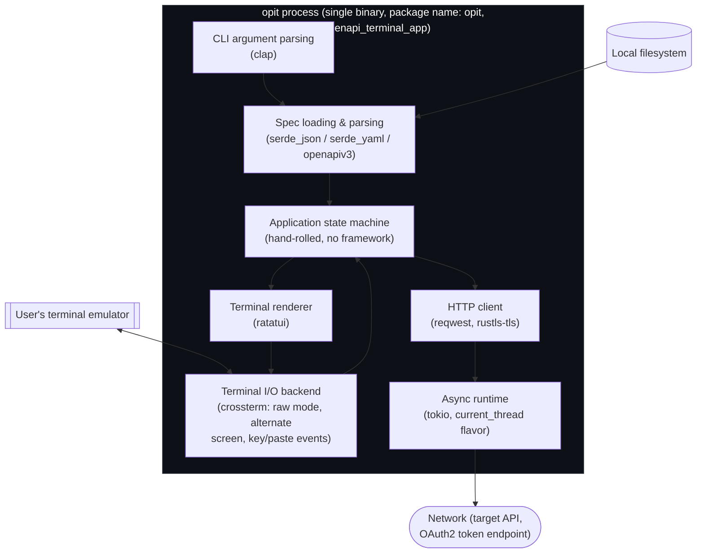
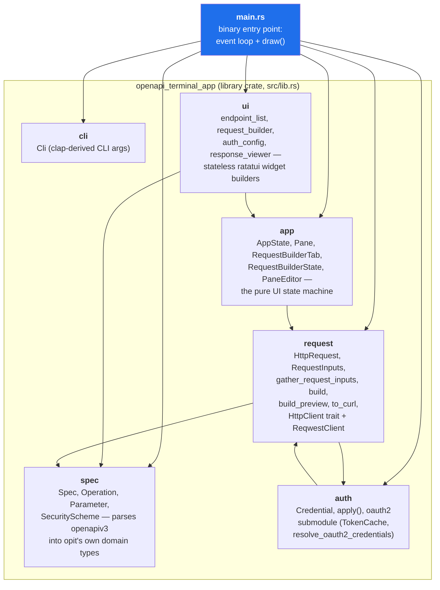
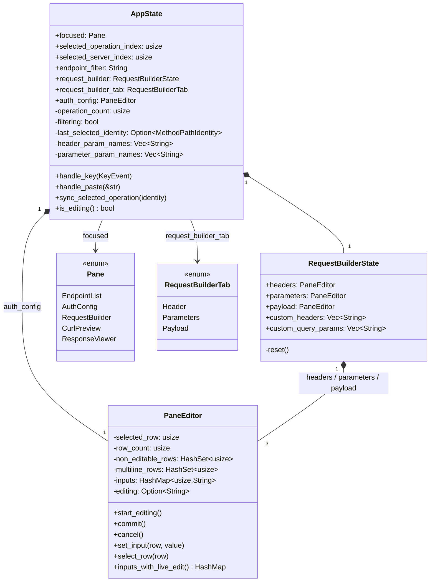
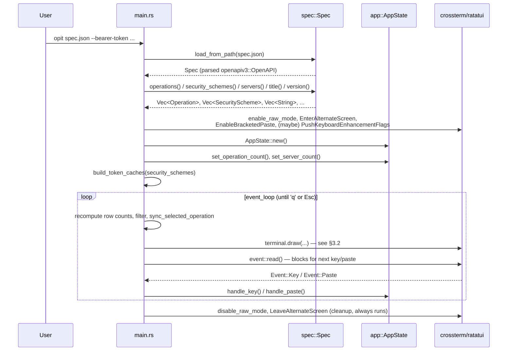
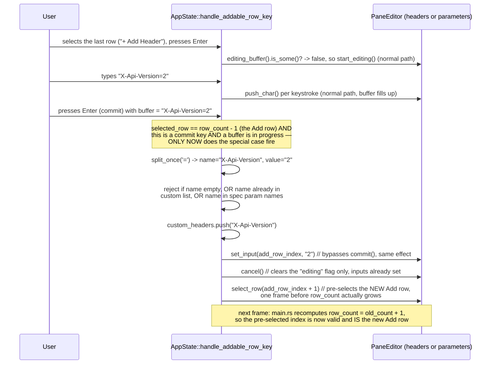
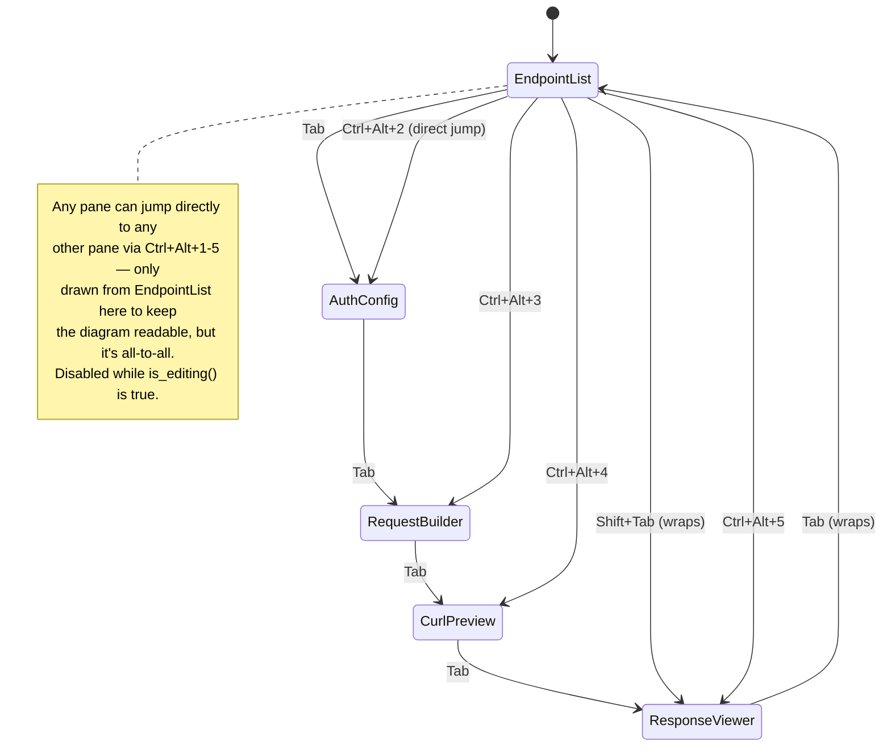
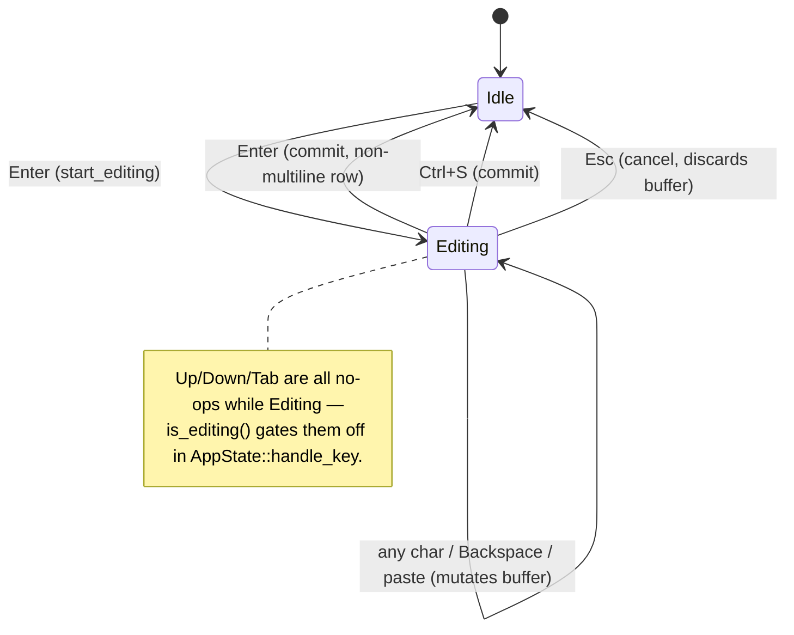
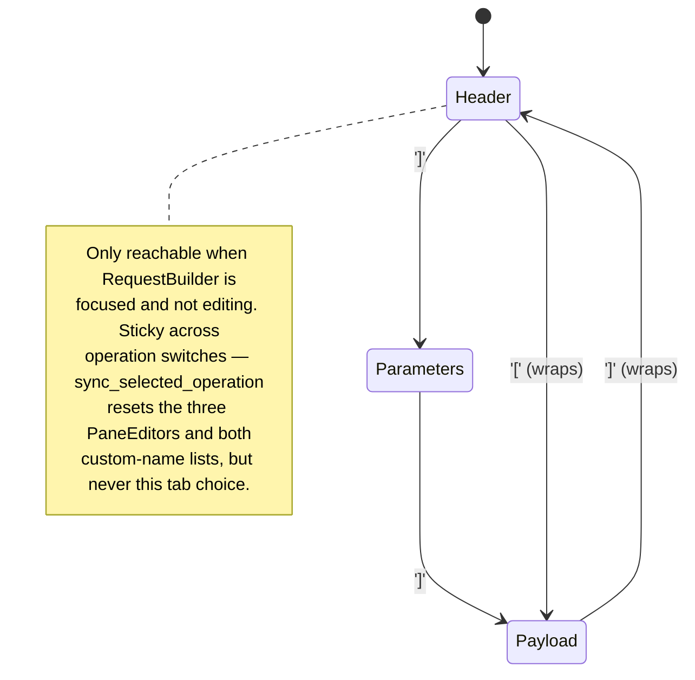
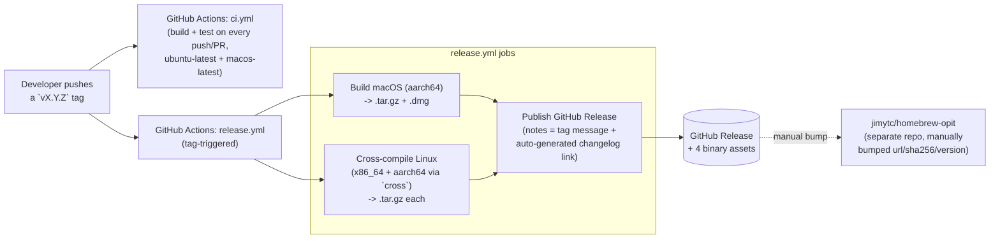

# opit Architecture

**Audience:** engineers joining the opit project (including Codex, our test-authoring
partner) who need to understand how the system fits together before making changes.
**Scope:** as of `v0.2.2`. Update this document whenever a change alters a module
boundary, a data flow, or an invariant described here — an architecture doc that drifts
from the code is worse than none.

## 1. What opit is, in one paragraph

opit is a single-binary Rust terminal application (TUI) for browsing an OpenAPI 3.0
document and sending live HTTP requests against it, without leaving the terminal. You
point it at a spec file; it parses the spec into a list of operations, renders them in a
keyboard-navigable multi-pane layout, lets you fill in parameters/headers/body/auth
interactively, shows a live `curl`-equivalent preview as you type, and sends the real
request over the network when you press Enter. There is no server component, no
database, and no persisted state between runs — every run starts from the spec file and
whatever CLI flags you pass.

## 2. C4 Model

### 2.1 Level 1 — System Context

Who uses opit, and what does it talk to?



Key facts this diagram should leave you with:
- opit is a **client**, never a server — it has no listening port and no persisted
  state directory. Everything it knows comes from the spec file at startup plus what you
  type in the current session.
- The **target API** is untyped from opit's point of view — it's just "whatever base URL
  and paths the spec declares," reached over plain HTTP(S) via `reqwest`.
- The **OAuth2 token endpoint** is only contacted lazily, at the moment a request is
  actually sent, and only for security schemes using the `clientCredentials` flow (see
  §7.3 for why this is deliberately synchronous-vs-async split).

### 2.2 Level 2 — Containers

"Container" here means *runtime process/deployment unit*, not Docker. opit has exactly
one: the compiled binary itself. The diagram below shows what's packaged inside that one
process and the runtime libraries it leans on — useful for understanding *why* certain
things behave the way they do (e.g. why the whole app blocks on a single event loop, why
HTTP calls are async but keyboard input is sync).



Notes:
- **Everything runs on one OS thread** (`#[tokio::main(flavor = "current_thread")]` in
  `main.rs`). The event loop `await`s the HTTP send call directly — while a request is in
  flight, the UI does not repaint and does not read new keystrokes. This is a deliberate
  simplicity trade-off for a personal/dev-tool TUI, not an oversight; if opit ever needs
  a "cancel in-flight request" feature, this is the thing that has to change first.
- **ratatui never talks to the network or the filesystem.** It only turns `AppState` +
  spec data into terminal cells. This separation is what makes the `ui::*` widgets
  trivially unit-testable (see §6) — you build a fake `Buffer`, render into it, assert on
  cell contents, no I/O involved.
- **crossterm owns the raw terminal mode toggle and the Kitty keyboard protocol
  negotiation** (`supports_keyboard_enhancement()` / `PushKeyboardEnhancementFlags`) —
  this is why `Ctrl+Alt+1`-`5` pane jumps require terminal support: crossterm is doing a
  real capability handshake with whatever terminal is attached, not something opit can
  force.

### 2.3 Level 3 — Components (the `src/` module map)

This is the level you'll spend the most time in. Each box below is a Rust module under
`src/`; arrows are `use` dependencies (source depends on target).



Responsibilities, one line each:

| Module | Owns | Does NOT own |
|---|---|---|
| `cli` | Parsing `opit <spec> [--bearer-token] [--header ...]` | Anything about the spec's contents |
| `spec` | Turning an `openapiv3::OpenAPI` into opit's flatter `Operation`/`Parameter`/`SecurityScheme` types; example-JSON generation from schemas | Rendering, HTTP, auth resolution |
| `app` | All UI *state*: which pane is focused, which Request Builder tab is active, per-row edit buffers, scroll offsets, the endpoint filter string | Rendering (no ratatui import), HTTP (no reqwest import), parsing (no openapiv3 import) |
| `ui` | Turning `(state, spec data)` into a ratatui `List`/`Paragraph` — pure functions, no mutation | Deciding *what* state to show (that's `main.rs`'s job, see §3.2) |
| `request` | Assembling an `HttpRequest` from spec + user input, and the `HttpClient` trait used to actually send it | Where the input values come from (that's `app`) |
| `auth` | Turning a `SecurityScheme` + raw credential input into request-mutating side effects; OAuth2 token fetch + cache | Storing which row the user is editing (that's `app::PaneEditor`) |
| `main.rs` | **Wiring**: reads `AppState` + spec data each frame, calls into `ui`/`request`/`auth`, owns the `tokio` event loop | Any business logic of its own — if you find yourself writing a non-trivial `if` in `main.rs`, it probably belongs in `app` or `request` instead |

### 2.4 Level 4 — Code: the core state types

The trickiest part of opit's design is the Request Builder's three independent
sub-editors. This class diagram is the one to keep open while touching anything in
`src/app/mod.rs` or `src/ui/request_builder.rs`.



Why three `PaneEditor`s instead of one? Each Request Builder tab (Header, Parameters,
Payload) is genuinely its own independent list from the user's point of view — its own
cursor, its own in-progress edit, its own committed values — and `PaneEditor` is
deliberately generic (it's the exact same type `auth_config` uses). Bolting
tab-awareness into `PaneEditor` itself would have made it stop being reusable and
stopped being trivially unit-testable in isolation. See `tests/pane_editor.rs` for its
~35 tests, none of which know `RequestBuilderTab` exists.

## 3. Runtime behavior: sequence diagrams

### 3.1 Startup



### 3.2 One frame of the render loop

This runs on every iteration of the `loop` in `event_loop` (`main.rs`), *before* waiting
for the next key — i.e. state derived from the spec is recomputed every frame rather than
cached, which is what keeps `AppState` itself free of any `Operation`/`Spec` references.

```mermaid
sequenceDiagram
    participant Loop as event_loop
    participant EL as ui::endpoint_list
    participant App as AppState
    participant Widgets as ui::* widgets
    participant Req as request::gather_request_inputs

    Loop->>EL: filtered_operations(operations, endpoint_filter)
    EL-->>Loop: Vec<&Operation> (filtered + tag-grouped)
    Loop->>App: set_operation_count(filtered.len())
    Loop->>App: sync_selected_operation((method, path))
    Note over App: resets Request Builder state<br/>if the selected operation's identity changed
    Loop->>Loop: partition selected op's params via<br/>Operation::header_parameters()/non_header_parameters()
    Loop->>App: request_builder.headers/parameters.set_row_count(...)
    Loop->>App: set_header_param_names() / set_parameter_param_names()
    Loop->>EL: render(filtered, selected_operation_index)
    EL-->>Loop: (List widget, visual_row_index)
    Loop->>Widgets: request_builder::widget(tab, op, custom_*, ...)
    Loop->>Widgets: auth_config::widget(...), response_viewer::widget(...)
    Loop->>Req: gather_request_inputs(op, headers.inputs_with_live_edit(), ...)
    Req-->>Loop: RequestInputs
    Loop->>Loop: request::build_preview(...) -> to_curl() for the live preview
    Loop->>Loop: terminal.draw() paints everything above into one frame
```

### 3.3 Sending a request (Enter on Endpoints)

```mermaid
sequenceDiagram
    participant User
    participant App as AppState
    participant Req as request module
    participant Auth as auth::oauth2
    participant Client as HttpClient (ReqwestClient)
    participant API as Target API

    User->>App: Enter (focused == EndpointList, not editing)
    App->>Req: gather_request_inputs(op, headers.inputs(), parameters.inputs(),<br/>custom_headers, custom_query_params, payload.inputs())
    Req-->>App: RequestInputs
    App->>Req: missing_required_params(op, &inputs)
    alt any required param missing/empty
        Req-->>App: Vec<String> (non-empty)
        App->>App: set_response(status:0, "Missing required parameter(s): ...")
        Note over App: request is NOT sent
    else all required params present
        App->>Req: build_preview(base_url, op, &inputs, schemes, auth_inputs, cli_creds)
        Req-->>App: HttpRequest (path/query/header/cookie + body + Content-Type +<br/>CLI/interactive credentials already applied)
        App->>Auth: resolve_oauth2_credentials(schemes, auth_inputs, token_caches, http, clock)
        Note over Auth: only contacts the token endpoint for clientCredentials<br/>schemes with a filled-in client_id:client_secret row;<br/>reuses a cached token if still valid (30s expiry skew)
        Auth-->>App: Vec<Credential> (Bearer tokens)
        App->>App: auth::apply() each credential onto the request
        App->>Client: http_client.send(request)
        Client->>API: real HTTP call (reqwest)
        API-->>Client: response
        Client-->>App: HttpResponse (or HttpError)
        App->>App: set_response(...)
    end
```

### 3.4 Adding a custom header/query parameter (the "+ Add" row)

This is the least obvious control flow in the codebase — worth internalizing before you
touch `handle_addable_row_key`.



## 4. State machines

### 4.1 Pane focus



### 4.2 `PaneEditor` per-row editing



### 4.3 Request Builder tab



## 5. Deployment

Not part of the strict C4 model, but essential for a new joiner who'll be asked "how do
we ship this":



End users install via `brew install jimytc/opit/opit`, a downloaded `.dmg`, or a Linux
tarball from the release page — see the main `README.md`'s Install section.

## 6. Testing philosophy (read this before writing any code)

opit is built under **strict TDD**, and the test suite (35 files under `tests/`,
integration-style — no `#[cfg(test)]` unit tests inside `src/`) is the actual source of
truth for behavior, more so than this document. A few load-bearing conventions:

- **Red/green/refactor as separate commits.** A commit that adds a failing test never
  also touches `src/`; a commit that makes it pass never also touches `tests/`. `git log`
  reads as an alternating `test: ...` / `feat: ...` / `fix: ...` sequence — that's
  intentional, not incidental.
- **Test-writing is delegated to Codex CLI** (`codex exec`), prompted with precise
  behavioral specs (never vague asks). Claude reviews the resulting tests for
  correctness/scope before treating them as the RED step, then writes only the `src/`
  change needed to turn them green.
- **`ui::*` widgets are tested by rendering into a `ratatui::buffer::Buffer` and
  asserting on cell text/style** — no terminal, no snapshot files. See
  `tests/ui_request_builder.rs` for the density of coverage this enables (tab-specific
  row layout, Add-row rendering, highlight styles, all pure-function-tested).
  `app::*` is tested by constructing an `AppState` directly and driving it with
  `crossterm::event::KeyEvent`s — again no terminal involved.
- **Manual/tmux verification is the last step of any UI-visible change**, not a
  replacement for automated tests — used to catch things a `Buffer`-level assertion
  can't (real terminal escape sequences, actual layout proportions, genuine
  Kitty-protocol behavior). Not committed as an artifact; it's a one-time check before
  calling a change done.

Run the whole suite with `cargo test`; run one file with
`cargo test --test <file_stem>` (e.g. `cargo test --test app_pane_editing`).

## 7. Design decisions worth knowing before you change things

These are invariants that aren't obvious from reading any single file in isolation —
each was either a deliberate trade-off or a bug caught during development.

### 7.1 Row-index conventions are load-bearing

`PaneEditor` stores committed values in a `HashMap<usize, String>` keyed by row index,
not by parameter name. Two conventions make this safe:
- **The Payload editor always has exactly 1 row, always index 0** — regardless of
  whether the spec declares a `requestBody` for the selected operation. This is what
  lets you type a body for an operation the spec says has none.
- **The Header/Parameters editors' last row is always the "+ Add" row.** Its index is
  `row_count() - 1`, recomputed every frame in `main.rs` as
  `spec_params.len() + custom_names.len() + 1`. Custom rows, once added, permanently
  occupy the position they were created at (`spec_params.len() + k` for the k-th custom
  name) — this is why `gather_request_inputs` can zip `custom_headers[k]`'s *name*
  against `header_inputs[header_parameters().len() + k]`'s *value* without any extra
  bookkeeping.

If you ever change how rows are counted for these editors, grep for
`Operation::header_parameters`/`non_header_parameters` first — it's the single shared
partition function three different call sites rely on staying identical (row-count
computation in `main.rs`, widget row-building in `ui::request_builder`, and
`gather_request_inputs`). A Plan-review during the Request Builder redesign specifically
flagged that duplicating this filter independently in multiple places risks the
rendered row order silently disagreeing with the row order values are read back from.

### 7.2 Identity-based reset, not index-based

`AppState::sync_selected_operation` resets Request Builder state when the **(method,
path) identity** of the selected operation changes — not when `selected_operation_index`
changes. This exists because the endpoint list can be filtered/re-grouped between
frames; if the same numeric index ends up pointing at a *different* operation (e.g. the
filter text changed), index-equality alone would fail to notice and would leave stale
param values attached to the wrong operation.

### 7.3 OAuth2 resolution is deliberately split sync/async

`auth::credentials_from_inputs` (used for the *live* curl preview, called every frame) is
synchronous and explicitly **never** resolves OAuth2 client_credentials — see the comment
in `src/auth/mod.rs`. Fetching a real token requires a network round-trip, and the curl
preview must never block the render loop or make a network call per keystroke.
`auth::oauth2::resolve_oauth2_credentials` (async, only called once, at actual send time)
does the real fetch-or-reuse-cached-token work. This is why the curl preview can show
every other auth scheme's effect immediately but not OAuth2's bearer token until you
actually press Enter to send.

### 7.4 Why `RequestInputs` exists

Before the Request Builder tab split, `request::build`/`missing_required_params` took a
single `HashMap<usize, String>` indexed directly against `operation.parameters`. Once
Header/Parameters/Payload became three independently-indexed editors, that one-map
convention broke — the same row index means different things in different editors. The
`RequestInputs` struct (`param_values: HashMap<String,String>` plus `extra_headers`/
`extra_query`/`body`) is the seam that decouples "where a value physically lives" (which
editor, which row) from "what `request::build` needs" (name-keyed values plus ad-hoc
extras) — `gather_request_inputs` is the only place that does the index-to-name
resolution.

### 7.5 Terminal keyboard protocol

`Ctrl+Alt+1`-`5` relies on the Kitty keyboard protocol
(`crossterm::terminal::supports_keyboard_enhancement` +
`PushKeyboardEnhancementFlags::DISAMBIGUATE_ESCAPE_CODES`) to disambiguate from plain
`Ctrl+2` (which historically collides with a legacy control-code byte). opit checks
support and enables it conditionally — terminals/multiplexers without support just don't
get reliable jump-keys for some digits; `Tab`/`Shift+Tab` cycling is unaffected and
always works. See the README's Known Limitations for user-facing detail.

## 8. Where to add things

- **A new pane**: add a variant to `app::Pane`, add it to `PANE_CYCLE`, add its
  scroll/key handling in `AppState::handle_key`, add a `ui::<pane>::widget()` function,
  wire it into `main.rs`'s `draw()` with its own `Layout` slot and `pane_border_style()`
  call.
- **A new auth scheme kind**: extend `spec::SecuritySchemeKind`, extend
  `spec::security::security_schemes_from`'s match, extend `auth::Credential` +
  `auth::apply()`, extend `ui::auth_config`'s `static_text()` hint, and (if it needs
  network resolution like OAuth2) add a new resolution path parallel to
  `auth::oauth2::resolve_oauth2_credentials` — do not make `credentials_from_inputs`
  synchronous-but-network-calling; see §7.3.
- **A new Request Builder tab or row kind**: extend `RequestBuilderTab` +
  `REQUEST_BUILDER_TAB_CYCLE`, add a `PaneEditor` field to `RequestBuilderState` if it
  needs independent row state, extend `ui::request_builder::Row` and its `widget()`
  match arms, and check whether `gather_request_inputs` needs a new field on
  `RequestInputs`.
- **A new CLI flag**: extend `cli::Cli`, thread it through `main()` into whatever
  consumes it (most CLI flags so far feed `credentials_from_cli`).

## 9. Related documents

- `README.md` — end-user install/usage/keybindings documentation, and the release
  process.
- `tests/` — the actual behavioral specification; when in doubt about "is this a bug or
  a feature," the tests are more authoritative than this document.
